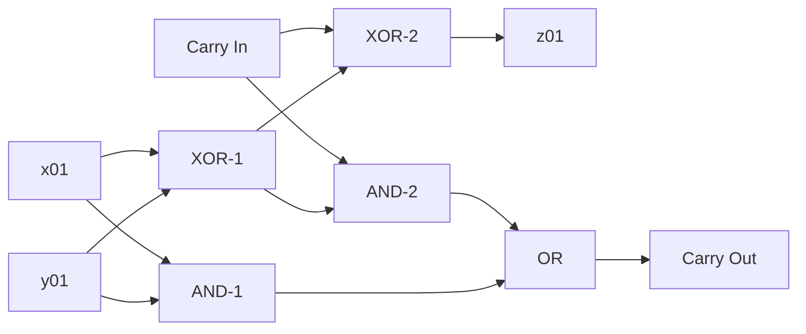

# 2024 Thoughts and Walkthroughs

## Opening Thoughts

This is the second year that I'm trying AoC. I'm not entirely sure why, but the first year (2023) I tried I thought it would be fun to do it in Perl. I learned how to code by using Perl. Not sure why I thought it would be fun to go back to that…

So for this year I'm getting serious. Well, as serious as one can get for a fun, nerdy pasttime. Which, as it turns out, some people can get very serious about.

I am not one of those people.

With all of that said, here we go…

## Solutions

### [Day 1: Historian Hysteria](https://adventofcode.com/2024/day/1)

Thankfully, things start slow and easy. Just need a quick parsing of the input file and then two different calculations.

#### $\textsf{\color{red}{Part 1: Difference score}}$

Take the absolute value of the difference between each set of numbers and all it all up

#### $\textsf{\color{green}{Part 2: Similarity score}}$

Using the left column of numbers, we reduce the array, at each stop multiplying the current value by the number of times it occurs in the right column.

### [Day 2: Red-Nosed Reports](https://adventofcode.com/2024/day/2)

#### $\textsf{\color{red}{Part 1:}}$

#### $\textsf{\color{green}{Part 2:}}$

### [Day 3: Mull It Over](https://adventofcode.com/2024/day/3)

#### $\textsf{\color{red}{Part 1:}}$

#### $\textsf{\color{green}{Part 2:}}$

### [Day 4: Ceres Search](https://adventofcode.com/2024/day/4)

#### $\textsf{\color{red}{Part 1:}}$

#### $\textsf{\color{green}{Part 2:}}$

### [Day 5: Print Queue](https://adventofcode.com/2024/day/5)

#### $\textsf{\color{red}{Part 1:}}$

#### $\textsf{\color{green}{Part 2:}}$

### [Day 6: Guard Gallivant](https://adventofcode.com/2024/day/6)

#### $\textsf{\color{red}{Part 1:}}$

#### $\textsf{\color{green}{Part 2:}}$

### [Day 7: Bridge Repair](https://adventofcode.com/2024/day/7)

#### $\textsf{\color{red}{Part 1:}}$

#### $\textsf{\color{green}{Part 2:}}$

### [Day 8: Resonant Collinearity](https://adventofcode.com/2024/day/8)

#### $\textsf{\color{red}{Part 1:}}$

#### $\textsf{\color{green}{Part 2:}}$

### [Day 9: Disk Fragmenter](https://adventofcode.com/2024/day/9)

#### $\textsf{\color{red}{Part 1:}}$

#### $\textsf{\color{green}{Part 2:}}$

### [Day 10: Hoof It](https://adventofcode.com/2024/day/10)

#### $\textsf{\color{red}{Part 1:}}$

#### $\textsf{\color{green}{Part 2:}}$

### [Day 11: Plutonian Pebbles](https://adventofcode.com/2024/day/11)

#### $\textsf{\color{red}{Part 1:}}$

#### $\textsf{\color{green}{Part 2:}}$

### [Day 12: Garden Groups](https://adventofcode.com/2024/day/12)

#### $\textsf{\color{red}{Part 1:}}$

#### $\textsf{\color{green}{Part 2:}}$

### [Day 13: Claw Contraption](https://adventofcode.com/2024/day/13)

#### $\textsf{\color{red}{Part 1:}}$

#### $\textsf{\color{green}{Part 2:}}$

### [Day 14: Restroom Redoubt](https://adventofcode.com/2024/day/14)

#### $\textsf{\color{red}{Part 1:}}$

#### $\textsf{\color{green}{Part 2:}}$

### [Day 15: Warehouse Woes](https://adventofcode.com/2024/day/15)

#### $\textsf{\color{red}{Part 1:}}$

#### $\textsf{\color{green}{Part 2:}}$

### [Day 16: Reindeer Maze](https://adventofcode.com/2024/day/16)

#### $\textsf{\color{red}{Part 1:}}$

#### $\textsf{\color{green}{Part 2:}}$

### [Day 17: Chronospatial Computer](https://adventofcode.com/2024/day/17)

#### $\textsf{\color{red}{Part 1:}}$

#### $\textsf{\color{green}{Part 2:}}$

### [Day 18: RAM Run](https://adventofcode.com/2024/day/18)

#### $\textsf{\color{red}{Part 1:}}$

#### $\textsf{\color{green}{Part 2:}}$

### [Day 19: Linen Layout](https://adventofcode.com/2024/day/19)

#### $\textsf{\color{red}{Part 1:}}$

#### $\textsf{\color{green}{Part 2:}}$

### [Day 20: Race Condition](https://adventofcode.com/2024/day/20)

All told, not too bad of a day. Especially once it dawned on me (by getting a tip from a friend that I should look into [Manhattan distance](https://www.datacamp.com/tutorial/manhattan-distance)). Parts 1 and 2 differ only by the length of time allowed for a cheat.

The cost of cheating through a single wall is 2, step-in and step-out. Because each move costs 1 unit of time this has a significant effect on how much one can cheat.

#### $\textsf{\color{red}{Part 1: Doing the two-step}}$

This first part is where almost 100% of the logic work was written.

I decided to use the Dijkstra algorithm that I wrote earlier to map out the path. Yes, there wasn't any branching, but it kept me from having to write a loop to find all the free spaces.

> [!NOTE]
> I refactored `DijkstraParams<T>` interface. This will most assuredly break previous usages until they are updated.

It was simple, then, to calculate the time distance between two points based on their positions in the path. And then by calculating the Manhattan distance between them I could see if the cheat was possible and if so, would it actually save more than 100 units requested.

#### $\textsf{\color{green}{Part 2: Parameterize the cheat time}}$

All this part required was to update the function parameters to accept a `maxCheatTime` rather than the hardcoded `2` that was there from Part 1.

### [Day 21: Keypad Conundrum](https://adventofcode.com/2024/day/21)

#### $\textsf{\color{red}{Part 1:}}$

#### $\textsf{\color{green}{Part 2:}}$

### [Day 22: Monkey Market](https://adventofcode.com/2024/day/22)

#### $\textsf{\color{red}{Part 1:}}$

#### $\textsf{\color{green}{Part 2:}}$

### [Day 23: LAN Party](https://adventofcode.com/2024/day/23)

#### $\textsf{\color{red}{Part 1:}}$

#### $\textsf{\color{green}{Part 2:}}$

### [$\textsf{\textbf{\color{red}{Day 24: Crossed Wires}}}$](https://adventofcode.com/2024/day/24)

Oh boy…

At the beginning of the day I thought this was going to be a breeze. Just some basic mapping and bitwise calculations. Little did I know that I knew nothing about [binary adders](https://en.wikipedia.org/wiki/Adder_(electronics)).

#### $\textsf{\color{red}{Part 1: Building and running a circuit}}$

So, create a few interfaces and parse the input file to give me an object to keep track of wire bit values and an object to track the gates and if they have run.

Just loop through the gates, running them if both input wires are initialized, writing the calculation to the output wire and marking the gate as run.

Then get the z-wire values in an array, and because we've sorted ascending, reverse the array and calculate the bit column value. Join those into a string and run `parseInt(…, 2)` to convert to decimal.

Easy peasy…

#### $\textsf{\color{green}{Part 2: Adder hell…}}$

So, not having any kind of C.S. degree or coursework, I did not catch on to the very heavily hinted at nature of the circuit in the story. Like I've often done, I start looking at what others are writing about for the day. Without looking at code I like to have some guidance as to where I should start learning.

I now know a very, veeeery small amount about binary adders. Just enough to get today’s answer. Go me.

So the gist being, the most basic half-adder takes two inputs and has two outputs. The "sum" is the result of an `AND` gate and the "carry" is passed through an XOR gate to the z-wire. A full-adder takes three inputs, two new values and a third carry value. It too outputs a sum and a carry.

And with that, we have our ripple-carry adder.

A simple diagram, using the second bit:

For a further walkthough see the comments in [`findBadWires`](src/2024/../../24/index.ts#L197)

### [Day 25: Code Chronicle](https://adventofcode.com/2024/day/25)

Having never made it this far before, I'm not sure yet about part 2. But I'm going to commit this part 1 and write up now in order to commemorate my confusion. 😂

#### $\textsf{\color{red}{Part 1: A basic math problem}}$

Quite a simple problem. You just need to make sure that there is no over lap in pins and key. So I chose to make the pins stalagtites with a negative value and the key teeth stalagmites with a positive value and as long as their sum is less than or equal to zero across all five pin/teeth combos we're good to go.

#### $\textsf{\color{green}{Part 2:}}$

We'll see…
